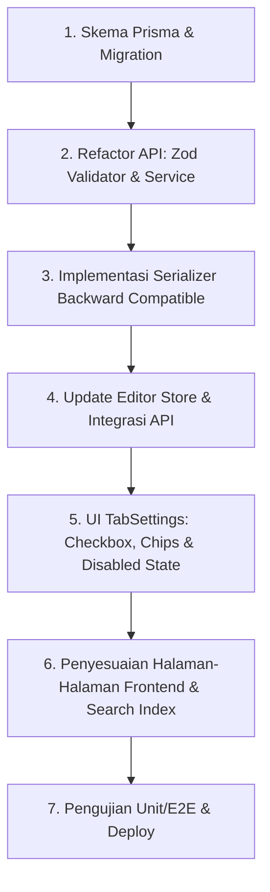

# Rencana Implementasi Multi-Kategori Artikel (Maksimal 3)

> ✅ **IMPLEMENTASI SELESAI** — Deploy ke production: 22 Juni 2026

> Tujuan: Mengubah sistem kategori artikel dari **single-select** menjadi **multi-select (maks 3 kategori)** untuk meningkatkan discoverability dan SEO.

---

## Ringkasan Perubahan

| Layer | Saat Ini | Setelah |
|---|---|---|
| **Database** | `categoryId String?` (FK tunggal di tabel `Article`) | Tabel join `ArticleCategory` (many-to-many) |
| **API Validator** | `z.string().nullable()` | `z.array(z.string()).max(3).optional()` |
| **Service** | `resolveCategoryId()` (single slug → UUID) | `resolveCategoryIds()` (loop resolve + validasi max 3) |
| **Repository** | `category: { select: ... }` (single relation) | `categories: { include: { category: ... } }` (join include) |
| **Frontend Store** | `categoryId: string \| null` | `categoryIds: string[]` |
| **UI (TabSettings)** | Single-select dropdown (radio) | Multi-select dropdown dengan checkbox + badge/chip |

---

## Tahap 1: Database Schema (Prisma)

### File: `apps/api/prisma/schema.prisma`

**1a. Tambah model join table `ArticleCategory`:**

```prisma
model ArticleCategory {
  articleId  String   @map("article_id")
  categoryId String   @map("category_id")
  createdAt  DateTime @default(now()) @map("created_at")

  article  Article  @relation(fields: [articleId], references: [id], onDelete: Cascade)
  category Category @relation(fields: [categoryId], references: [id], onDelete: Cascade)

  @@id([articleId, categoryId])
  @@index([categoryId])
  @@map("article_categories")
}
```

**1b. Modifikasi model `Article`:**
- Hapus field `categoryId String?`
- Hapus relasi `category Category? @relation(...)`
- Tambah relasi `categories ArticleCategory[]`
- Hapus index `@@index([categoryId])`

**1c. Modifikasi model `Category`:**
- Ganti relasi `articles Article[]` → `articleCategories ArticleCategory[]`

**1d. Migrasi data existing (Sangat Penting):**
Untuk mencegah kehilangan data kategori pada artikel yang sudah ada di database production, ikuti langkah migrasi aman ini:
1. Jalankan command berikut untuk membuat draft file migrasi SQL tanpa langsung mengeksekusinya ke database:
   ```bash
   npx prisma migrate dev --create-only --name add_article_multi_categories
   ```
2. Buka file `migration.sql` yang baru saja digenerate di dalam folder `apps/api/prisma/migrations/xxxxxxxx_add_article_multi_categories/migration.sql`.
3. Sisipkan SQL berikut **tepat sebelum** baris `ALTER TABLE "articles" DROP COLUMN "category_id";` (atau nama kolom aslinya):
   ```sql
   -- Salin data relasi kategori lama ke tabel join baru
   INSERT INTO "article_categories" ("article_id", "category_id")
   SELECT "id", "categoryId" FROM "Article" WHERE "categoryId" IS NOT NULL;
   ```
   *(Sesuaikan nama tabel dan kolom di SQL dengan skema PostgreSQL aktual jika ada perbedaan huruf besar/kecil).*
4. Jalankan migrasi untuk mengaplikasikannya secara lokal:
   ```bash
   npx prisma migrate dev
   ```

---


## Tahap 2: Backend API

### 2a. Validator — `apps/api/src/modules/article/article.validator.ts`

Untuk menjaga kompatibilitas API, skema validasi Zod dikonfigurasi untuk menerima `categoryId` (lama) dan `categoryIds` (baru), lalu menggabungkannya secara otomatis:

```typescript
// Tambahkan parser pembantu untuk menormalkan input
const optionalCategoryIds = z.preprocess(
  (val) => {
    if (val === '' || val === null || val === undefined) return []
    if (typeof val === 'string') return [val]
    return val
  },
  z.array(z.string()).max(3, 'Maksimal 3 kategori per artikel').default([])
)

// Di createArticleSchema:
export const createArticleSchema = z.object({
  title: z.string().trim().min(1, 'Judul wajib diisi').max(200),
  excerpt: z.string().trim().max(280).optional(),
  categoryId: z.string().optional().nullable(), // legacy field
  categoryIds: optionalCategoryIds,
  // ... field lainnya tetap sama
}).transform((data) => {
  const categoryIds = [...data.categoryIds]
  
  // Jika categoryId dikirim oleh client lama, masukkan ke index 0 (kategori utama)
  if (data.categoryId && !categoryIds.includes(data.categoryId)) {
    categoryIds.unshift(data.categoryId)
  }
  
  return {
    ...data,
    categoryIds: Array.from(new Set(categoryIds)).slice(0, 3),
    categoryId: undefined // Hapus legacy field agar tidak membebani service
  }
})

// Di updateArticleSchema:
export const updateArticleSchema = z.object({
  title: z.string().min(1).max(200).optional(),
  excerpt: z.string().trim().max(280).optional(),
  categoryId: z.string().optional().nullable(), // legacy field
  categoryIds: z.preprocess(
    (val) => {
      if (val === '' || val === null || val === undefined) return undefined // undefined artinya tidak diubah
      if (typeof val === 'string') return [val]
      return val
    },
    z.array(z.string()).max(3, 'Maksimal 3 kategori per artikel').optional()
  ),
  // ... field lainnya tetap sama
}).transform((data) => {
  const result = { ...data }
  
  // Konsolidasikan hanya jika salah satu dikirim
  if (data.categoryId !== undefined || data.categoryIds !== undefined) {
    let resolved: string[] = []
    if (data.categoryIds) {
      resolved = [...data.categoryIds]
    }
    if (data.categoryId) {
      if (!resolved.includes(data.categoryId)) {
        resolved.unshift(data.categoryId)
      }
    }
    
    result.categoryIds = Array.from(new Set(resolved)).slice(0, 3)
  }
  
  delete result.categoryId
  return result
})
```


### 2b. Service — `apps/api/src/modules/article/article.service.ts`

**Baru: `resolveCategoryIds()`**

```typescript
async function resolveCategoryIds(
  categoryIds: string[],
  siteId: string
): Promise<string[]> {
  if (!categoryIds.length) return []

  const resolved: string[] = []
  for (const id of categoryIds) {
    // Reuse logika resolveCategoryId yang sudah ada
    const catId = await resolveCategoryId(id, siteId)
    if (catId) resolved.push(catId)
  }

  if (resolved.length > 3) {
    throw new AppError('Maksimal 3 kategori per artikel', 400)
  }

  return resolved
}
```

**Modifikasi `createArticle()`:**
- Ganti `resolveCategoryId(input.categoryId, siteId)` → `resolveCategoryIds(input.categoryIds, siteId)`
- Saat create, buat record `ArticleCategory` via nested create:
  ```typescript
  categories: {
    create: resolvedCategoryIds.map(id => ({ categoryId: id }))
  }
  ```

**Modifikasi `updateArticle()`:**
- Jika `input.categoryIds` ada, gunakan **nested write atomik** (bukan deleteMany + createMany terpisah) untuk menghindari data loss jika operasi gagal di tengah jalan:
  ```typescript
  await prisma.article.update({
    where: { id },
    data: {
      // field artikel lainnya...
      categories: {
        deleteMany: {}, // Hapus semua relasi lama
        create: resolvedCategoryIds.map(catId => ({
          categoryId: catId
        }))
      }
    }
  })
  ```
  > ⚠️ **PENTING**: Jangan pisahkan `deleteMany` dan `createMany` — jika `createMany` gagal setelah `deleteMany`, artikel kehilangan semua kategori tanpa rollback. Nested write Prisma memastikan atomicity dalam satu transaksi.

### 2c. Repository — `apps/api/src/modules/article/article.repository.ts`

**Modifikasi semua query `include/select`:**
```typescript
// Sebelum:
category: { select: { id: true, name: true, slug: true } }

// Sesudah:
categories: {
  include: {
    category: { select: { id: true, name: true, slug: true } }
  }
}
```

**Modifikasi filter by category:**
```typescript
// Sebelum:
categoryFilter.categoryId = { in: ids }

// Sesudah:
categoryFilter.categories = {
  some: { categoryId: { in: ids } }
}
```

### 2d. Response Shape & Backward Compatibility

Response API harus mendukung **dual format** untuk sementara waktu agar frontend yang belum di-refactor tidak crash saat backend dideploy duluan:

```json
{
  "category": { "id": "...", "name": "Politik", "slug": "politik" },
  "categories": [
    { "id": "...", "name": "Politik", "slug": "politik" },
    { "id": "...", "name": "Nasional", "slug": "nasional" }
  ]
}
```

**Serializer logic:**
- `categories` — array lengkap dari join table, dengan nested `category` di-flatten
- `category` — **legacy field**, berisi kategori pertama (index 0 / primary) untuk backward compatibility

```typescript
// Contoh serializer
function serializeArticleCategories(articleCategories: ArticleCategory[]) {
  const flat = articleCategories.map(ac => ({
    id: ac.category.id,
    name: ac.category.name,
    slug: ac.category.slug
  }))
  return {
    categories: flat,
    category: flat[0] || null  // backward compat: primary = index 0
  }
}
```

> ℹ️ **Kapan hapus `category` legacy?** Setelah semua frontend dan integrasi pihak ketiga sudah migrate ke `categories` array. Minimal 2-3 sprint setelah deploy.

---

## Tahap 3: Frontend — Editor Store

### File: `apps/web/store/editorStore.ts`

**3a. Ubah state:**
```typescript
// Hapus:
categoryId: string | null

// Ganti:
categoryIds: string[]
```

**3b. Modifikasi `setContentType()`:**
```typescript
if (contentType === 'photo_journalism') {
  updates.categoryIds = ['foto-jurnalistik']
  updates.isExclusive = true
} else if (contentType === 'video_exclusive') {
  updates.categoryIds = ['video']
  updates.isExclusive = true
}
```

**3c. Modifikasi `loadArticle()`:**
```typescript
// Sebelum:
const resolvedCategoryId = article.category?.slug || article.categoryId || null
categoryId: resolvedCategoryId,

// Sesudah:
const categoryIds = article.categories?.map(
  (c: { category?: { slug: string } }) => c.category?.slug || c.categoryId
) || []
categoryIds,
```

**3d. Modifikasi `saveArticle()`:**
```typescript
// Sebelum:
categoryId: s.categoryId || null,

// Sesudah:
categoryIds: s.categoryIds,
```

**3e. Modifikasi `hasMeaningfulContent()`:**
```typescript
// Sebelum:
Boolean(state.categoryId || ...)

// Sesudah:
Boolean((state.categoryIds && state.categoryIds.length > 0) || ...)
```

**3f. Modifikasi `getMissingRequirements()`:**
```typescript
// Sebelum:
if (!s.categoryId) missing.push('Kategori belum dipilih')

// Sesudah:
if (!s.categoryIds?.length) missing.push('Kategori belum dipilih')
```

**3g. Modifikasi `getCompletionScore()`:**
```typescript
// Sebelum:
if (s.categoryId) score += 20

// Sesudah:
if (s.categoryIds?.length) score += 20
```

**3h. Modifikasi `reset()`:**
```typescript
// Sebelum:
categoryId: null

// Sesudah:
categoryIds: []
```

---

## Tahap 4: Frontend — UI TabSettings

### File: `apps/web/components/editor/tabs/TabSettings.tsx`

**4a. Ubah destructuring dari store:**
```typescript
const {
  categoryIds,  // ganti categoryId
  // ...
} = useEditorStore()
```

**4b. Ubah `selectedCategoryName` → `selectedCategoryNames`:**
```typescript
const selectedCategoryNames = useMemo(() => {
  return categoryIds.map(slug => {
    const found = flatCategories.find(c => c.slug === slug || c.id === slug)
    return found?.name || slug
  })
}, [categoryIds, flatCategories])
```

**4c. Ubah `handleCategorySelect()` → toggle behavior:**
```typescript
const handleCategorySelect = (slug: string) => {
  if (categoryIds.includes(slug)) {
    // Deselect
    updateArticleData({ categoryIds: categoryIds.filter(s => s !== slug) })
  } else {
    // Select (max 3)
    if (categoryIds.length >= 3) return
    updateArticleData({ categoryIds: [...categoryIds, slug] })
  }
  // Jangan tutup dropdown — biarkan user pilih beberapa
}
```

**4d. Handler: "Jadikan Utama" (reorder primary category):**
```typescript
const handleSetPrimary = (slug: string) => {
  const reordered = [slug, ...categoryIds.filter(s => s !== slug)]
  updateArticleData({ categoryIds: reordered })
}
```

**4e. UI: Ganti radio-style menjadi checkbox + chip dengan primary indicator:**

Bagian yang menampilkan kategori terpilih (di atas dropdown). Kategori pertama (index 0) = kategori utama untuk canonical URL & breadcrumbs SEO:
```tsx
{/* Selected Categories as chips */}
{categoryIds.length > 0 && (
  <div className="flex flex-wrap gap-1.5">
    {categoryIds.map((slug, index) => {
      const name = flatCategories.find(c => c.slug === slug)?.name || slug
      const isPrimary = index === 0
      return (
        <span key={slug} className={cn(
          "inline-flex items-center gap-1 px-2 py-0.5 rounded-full text-[10px] font-semibold",
          isPrimary
            ? "bg-panel-accent/20 text-panel-accent ring-1 ring-panel-accent/30"
            : "bg-panel-accent/10 text-panel-accent"
        )}>
          {isPrimary && <Star size={8} className="fill-current" />}
          {name}
          {!isPrimary && (
            <button
              onClick={(e) => { e.stopPropagation(); handleSetPrimary(slug) }}
              className="ml-0.5 hover:text-panel-accent/70 text-[8px] underline"
              title="Jadikan Kategori Utama"
            >
              Utama
            </button>
          )}
          <button
            onClick={(e) => { e.stopPropagation(); handleCategorySelect(slug) }}
            className="hover:text-panel-accent/70"
          >
            <X size={10} />
          </button>
        </span>
      )
    })}
  </div>
)}
```

Tambahkan petunjuk teks kecil di bawah dropdown kategori untuk mengedukasi penulis:
```tsx
<p className="text-[10px] text-panel-text-muted mt-1.5 leading-relaxed">
  * Kategori pertama = kategori utama (URL kanonis). Klik "Utama" pada chip lain untuk mengubah.
</p>
```

Dropdown items: ganti `✓` dengan checkbox:
```tsx
<span className={cn(
  "w-3.5 h-3.5 rounded border flex items-center justify-center",
  categoryIds.includes(cat.slug)
    ? "bg-panel-accent border-panel-accent text-white"
    : "border-panel-border"
)}>
  {categoryIds.includes(cat.slug) && <span className="text-[8px]">✓</span>}
</span>
```

Tambah counter di header dropdown:
```tsx
<span className="text-[10px] text-panel-text-muted">
  {categoryIds.length}/3 dipilih
</span>
```

**4f. Disabled state saat limit tercapai:**

Ketika `categoryIds.length >= 3`, semua item yang belum dipilih di dropdown harus **disabled** (redup, tidak bisa diklik) + tooltip:
```tsx
const isMaxReached = categoryIds.length >= 3

// Di setiap dropdown item yang belum dipilih:
<button
  onClick={() => handleCategorySelect(cat.slug)}
  disabled={isMaxReached && !categoryIds.includes(cat.slug)}
  className={cn(
    "w-full px-3 py-2 text-left text-xs transition-colors flex items-center justify-between",
    isMaxReached && !categoryIds.includes(cat.slug)
      ? "opacity-40 cursor-not-allowed"
      : "hover:bg-panel-elevated cursor-pointer"
  )}
  title={isMaxReached && !categoryIds.includes(cat.slug) ? "Maksimal 3 kategori telah dipilih" : undefined}
>
```

**4g. Hapus tombol "Hapus Pilihan" lama, ganti dengan "Reset Semua":**
```tsx
{categoryIds.length > 0 && (
  <button
    onClick={() => updateArticleData({ categoryIds: [] })}
    className="w-full px-3 py-2 text-left text-[11px] font-semibold text-red-500 hover:bg-panel-elevated border-b border-panel-border"
  >
    Hapus Semua Kategori
  </button>
)}
```

---

## Tahap 5: Frontend — Halaman Lain yang Perlu Disesuaikan

| File | Perubahan |
|---|---|
| `apps/web/components/editor/tabs/TabSEO.tsx` | Jika menampilkan kategori, sesuaikan dari `categoryId` → `categoryIds` |
| `apps/web/app/[site]/artikel/[slug]/page.tsx` | Response parsing: `article.categories` bukan `article.category` |
| `apps/web/components/pages/ArticlePage.tsx` | Badge/link kategori: loop `categories` bukan single `category` |
| `apps/web/components/pages/SiteHomePage.tsx` | Card artikel: tampilkan beberapa kategori badge |
| `apps/web/app/[site]/dashboard/articles/page.tsx` | Jika ada filter/display kategori di list |

---

## Tahap 6: Backward Compatibility & Edge Cases

### Input Backward Compatibility (Validator)

Selain menerima `categoryIds` (array baru), validator juga harus menerima `categoryId` (lama, string tunggal) dan mengonversinya ke array:

```typescript
// Di Zod preprocess:
const optionalCategoryIds = z.preprocess(
  (val, ctx) => {
    // Support legacy single categoryId
    if (ctx.path.includes('categoryId') || typeof val === 'string') {
      if (val === '' || val === null || val === undefined) return []
      return [val]
    }
    if (Array.isArray(val)) return val
    return []
  },
  z.array(z.string()).max(3, 'Maksimal 3 kategori per artikel').default([])
)
```

Atau lebih bersih: handle di controller sebelum masuk service:
```typescript
// Di controller create/update:
const categoryIds = input.categoryIds
  ?? (input.categoryId ? [input.categoryId] : [])
```

### Edge Cases

1. **Content type auto-category** — `photo_journalism` dan `video_exclusive` tetap auto-set 1 kategori (sebagai elemen pertama array). Jika user sudah punya kategori lain, kategori auto di-prepend (max tetap 3).

2. **Slug resolution** — `resolveCategoryId()` yang existing tetap dipertahankan, `resolveCategoryIds()` hanya wrapper yang memanggilnya dalam loop.

3. **Category query filter** — Frontend fetch `/categories/tree` tidak berubah. Yang berubah hanya cara filter di repository (pakai `some` pada join table).

4. **Meilisearch indexing** — Di file `apps/api/src/modules/article/search.service.ts` pada fungsi `_indexArticle`, sesuaikan properti category agar tetap terindeks menggunakan ID kategori utama (index 0) dan tambahkan properti array `categoryIds` untuk pencarian multi-kategori di masa depan:
   ```typescript
   // Ubah di _indexArticle:
   categoryId: article.categoryId || (article.category as any)?.id || null,
   categoryIds: article.categories 
     ? (article.categories as any[]).map(c => c.category?.id || c.categoryId) 
     : []
   ```


5. **Existing data migration** — Strategi migrasi tergantung stage production:

   **Opsi A: Migrasi Langsung (traffic rendah / development):**
   - Backup DB
   - Jalankan migration Prisma: buat tabel `article_categories`
   - Jalankan script copy data: `INSERT INTO article_categories (article_id, category_id) SELECT id, category_id FROM articles WHERE category_id IS NOT NULL`
   - Drop kolom `articles.category_id`
   - ⚠️ Ini **irreversible** tanpa manual rollback

   **Opsi B: Migrasi 3 Fase (traffic production tinggi, zero-downtime):**
   - **Fase 1 (Double Write)**: Buat tabel `article_categories`. Backend menulis ke kedua tempat (tabel baru + kolom lama). Script background salin data lama ke tabel baru.
   - **Fase 2 (Read New)**: Backend baca kategori hanya dari tabel `article_categories`. Pantau stabilitas.
   - **Fase 3 (Clean Up)**: Hapus kolom `articles.category_id` via migrasi terpisah.

---

## Urutan Implementasi (Disempurnakan)



| Step | Target | Detail |
|------|--------|--------|
| 1 | `schema.prisma` + migration | Buat `ArticleCategory`, update `Article` & `Category`, migrasi data |
| 2 | `article.validator.ts` + `article.service.ts` | `categoryIds` array max 3, `resolveCategoryIds()`, atomic nested write |
| 3 | `article.repository.ts` + serializer | Dual response (`category` + `categories`), backward compat |
| 4 | `editorStore.ts` | `categoryIds: string[]`, load/save/reset/score |
| 5 | `TabSettings.tsx` | Multi-select checkbox, chips dengan "Jadikan Utama", disabled state |
| 6 | Halaman frontend lain + Meilisearch | Artikel detail, home, list — parsing `categories` array |
| 7 | Testing + deploy | Unit test service/validator, E2E test editor flow |

---

## Estimasi Dampak

| Aspek | Risiko | Mitigasi |
|---|---|---|
| **Breaking change API** | Semua client yang kirim `categoryId` akan gagal | Support kedua field sementara: terima `categoryId` (konversi ke array) dan `categoryIds` |
| **Data migration** | Data existing bisa hilang jika migration gagal | Backup DB sebelum migrate, buat migration reversible |
| **SEO** | URL kategori page mungkin berubah | Pastikan slug-based routing tetap sama, redirect jika perlu |
| **Performance** | Join table tambah 1 query | Sudah ter-optimasi dengan `include` Prisma, negligible |

---

## Checklist

- [x] Prisma schema: `ArticleCategory` model + update `Article` & `Category`
- [x] Prisma migration + data migration script
- [x] Validator: `categoryIds` array dengan max 3
- [x] Service: `resolveCategoryIds()` + atomic nested write update
- [x] Repository: update semua include/select/filter (pakai `some`)
- [x] Serializer: backward compat dual response (`category` + `categories`)
- [x] Controller: accept `categoryId` lama (konversi ke array) + `categoryIds` baru
- [x] `editorStore.ts`: `categoryIds` array + load/save/reset/score
- [x] `TabSettings.tsx`: multi-select checkbox + chip + "Jadikan Utama" + disabled state
- [x] Halaman lain: update parsing `categories` array
- [x] Meilisearch: update indexing field
- [x] Unit tests (validator, service, repository)
- [ ] E2E tests (editor multi-select flow) — belum dikerjakan
- [x] Pilih strategi migrasi: langsung (traffic rendah)
- [x] Deploy + migrasi data
