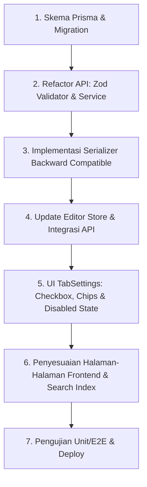

# Analisis & Rekomendasi: Rencana Implementasi Multi-Kategori Artikel

Dokumen ini berisi tinjauan teknis, analisis dampak, serta saran perbaikan terhadap rencana implementasi yang tertuang dalam [plan-multikatagori.md](file:///d:/beritakarya-v.0.1/plan-multikatagori.md).

---

## 1. Tinjauan Umum & Apresiasi
Rencana implementasi yang dibuat sudah **sangat detail, terstruktur, dan komprehensif**. Rencana ini mencakup semua layer aplikasi mulai dari skema database (Prisma), API validator (Zod), logika service, repository, state management (Zustand/editorStore), hingga komponen UI dan penyesuaian halaman frontend lainnya. Strategi migrasi data dan backward compatibility juga telah dipertimbangkan dengan baik.

---

## 2. Saran & Rekomendasi Teknis (Crucial Suggestions)

### A. Database & Prisma Query Atomicity (Tahap 2b)
Dalam rencana tertulis bahwa proses update kategori pada `updateArticle()` dilakukan dengan:
1. Menghapus data lama: `await prisma.articleCategory.deleteMany({ where: { articleId: id } })`
2. Membuat data baru: `await prisma.articleCategory.createMany({ data: ... })`

> [!WARNING]
> **Risiko Integritas Data**: Jika langkah kedua (`createMany`) gagal karena masalah jaringan atau kendala database lainnya setelah langkah pertama selesai, artikel tersebut akan kehilangan semua kategorinya (kategori menjadi kosong). 

**Rekomendasi**: Lakukan operasi ini secara atomik menggunakan fitur **Nested Writes** bawaan Prisma di dalam satu transaksi `update` artikel. Ini memastikan jika salah satu langkah gagal, seluruh perubahan akan di-rollback.

```typescript
// Rekomendasi Update Atomik
await prisma.article.update({
  where: { id },
  data: {
    // field artikel lainnya...
    categories: {
      deleteMany: {}, // Menghapus semua relasi ArticleCategory terkait artikel ini
      create: resolvedCategoryIds.map(catId => ({
        categoryId: catId
      }))
    }
  }
})
```

### B. Konsep "Kategori Utama" (Primary Category) untuk SEO & UI
Dalam sistem multi-kategori (maksimal 3), sistem memerlukan satu **kategori utama** (Primary Category) untuk:
1. **Canonical URL / Breadcrumbs (SEO)**: Menghindari masalah konten duplikat (*duplicate content*). Mesin pencari seperti Google membutuhkan satu URL kanonis tunggal untuk diindeks (misal: `domain.com/[kategori-utama]/[slug]`).
2. **Visual Tampilan Terbatas**: Menentukan kategori mana yang ditampilkan sebagai badge utama pada kartu artikel (article card) di halaman depan (*homepage*) atau hasil pencarian.

> [!NOTE]
> **Keputusan Desain**: Kita menggunakan pendekatan **Kategori Utama Implisit (Array Index 0)**. Kategori pertama yang dipilih oleh penulis otomatis menjadi kategori utama untuk URL. Ini adalah opsi paling efisien karena tidak mengubah struktur database, dan logika urutan ini telah ditambahkan ke skema UI di [plan-multikatagori.md](file:///d:/beritakarya-v.0.1/plan-multikatagori.md).

---


### C. Strategi Backward Compatibility pada API Response (Tahap 2d)
Mengubah response shape dari objek `category` menjadi array `categories` adalah perubahan yang merusak (*breaking change*). Jika frontend dideploy secara bertahap atau terdapat aplikasi/integrasi pihak ketiga, ini akan menyebabkan crash langsung.

**Rekomendasi**: Selain mengembalikan array `categories`, tetap sertakan properti legacy `category` (berisi kategori utama/pertama) di dalam response API serializer untuk sementara waktu:

```json
{
  "category": { "id": "...", "name": "Politik", "slug": "politik" }, 
  "categories": [
    { "id": "...", "name": "Politik", "slug": "politik" },
    { "id": "...", "name": "Nasional", "slug": "nasional" }
  ]
}
```
*Dengan cara ini, halaman frontend yang belum di-refactor ke sistem multi-kategori tidak akan mengalami crash saat backend dideploy.*

---

### D. Peningkatan UX di Dropdown Kategori (Tahap 4)
Pada `TabSettings.tsx`, rencana membatasi pemilihan maksimal 3 di fungsi handler (`if (categoryIds.length >= 3) return`).

**Rekomendasi UX**: 
- Jika jumlah kategori yang dipilih sudah mencapai 3, buat opsi kategori lain di dalam dropdown menjadi **disabled** (redup dan tidak bisa diklik), dan berikan tooltip info: *"Maksimal 3 kategori telah dipilih"*.
- Ini jauh lebih intuitif bagi penulis dibandingkan membiarkan tombol bisa diklik tetapi tidak memberikan reaksi apa pun.

---

### E. Zero-Downtime Migration di Produksi (Tahap 6.5)
Jika aplikasi ini sudah berjalan aktif di production dengan jumlah data yang cukup banyak, menjalankan migrasi skema Prisma yang langsung men-drop kolom `articles.category_id` dalam satu transaksi migrasi berisiko tinggi menyebabkan *downtime* atau *lock* pada database.

**Rekomendasi Strategi Migrasi 3 Fase (jika traffic tinggi)**:
1. **Fase 1 (Double Write)**: Jalankan migrasi untuk membuat tabel `ArticleCategory`. Modifikasi backend agar saat menyimpan artikel, data ditulis ke tabel `ArticleCategory` dan kolom `articles.category_id` secara bersamaan. Jalankan script untuk menyalin data lama ke tabel baru di background.
2. **Fase 2 (Read New)**: Ubah backend untuk membaca kategori hanya dari tabel `ArticleCategory`. Pantau stabilitas sistem.
3. **Fase 3 (Clean Up)**: Hapus kolom `articles.category_id` yang sudah tidak digunakan lagi melalui migrasi database tersendiri.

---

## 3. Matriks Keputusan Implementasi

Untuk memudahkan implementasi, berikut perbandingan opsi desain yang bisa Anda pilih:

| Opsi Fitur | Kelebihan | Kekurangan | Rekomendasi |
| :--- | :--- | :--- | :--- |
| **Kategori Utama Implisit** (Array Index 0) | - Cepat diimplementasikan.<br>- Tidak perlu ubah skema DB. | - User tidak bisa memilih secara eksplisit mana yang utama tanpa menghapus & menyusun ulang. | **Pilihan Terbaik Awal** (bisa ditingkatkan nanti jika dirasa perlu). |
| **Kategori Utama Eksplisit** (`isPrimary` DB field) | - Sangat jelas dan presisi.<br>- SEO lebih terkontrol secara eksplisit. | - Kompleksitas UI editor bertambah.<br>- Perlu validasi tambahan (hanya 1 yang boleh `true`). | **Sangat Baik** untuk jangka panjang jika SEO adalah prioritas utama portal berita. |

---

## 4. Urutan Langkah Kerja yang Disempurnakan


