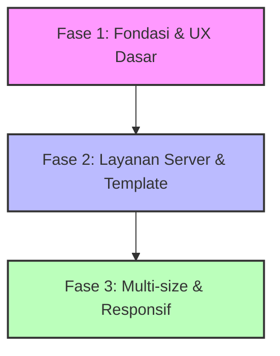

# Hasil Review Dokumen Rencana Sistem Iklan (plan.md)

Dokumen ini berisi analisis mendalam, baik secara teknis maupun bisnis, mengenai rencana infrastruktur dan penetapan harga slot iklan (Ads) untuk platform **BeritaKarya**.

---

## 1. Analisis & Pendapat Teknis (Technical Perspective)

Secara umum, arsitektur monorepo yang digunakan (`apps/web` dengan Next.js, `apps/api` dengan NestJS/Express, dan shared packages) sudah sangat ideal untuk mengimplementasikan fitur-fitur ini. Berikut detail teknis per fitur:

### A. Smart Resize + Letterbox Server-Side
*   **Pilihan Library (`sharp` vs `jimp`):** Sangat disarankan untuk menggunakan **`sharp`**. `sharp` berbasis C++ (libvips) yang kecepatannya 4-5x lebih cepat dan penggunaan memorinya jauh lebih kecil dibanding `jimp` (pure JavaScript). Ini krusial karena pemrosesan gambar di server API dapat membebani CPU jika banyak user melakukan upload bersamaan.
*   **Implementasi Blur Background:** Untuk hasil letterbox yang premium (estetis), Anda bisa menduplikasi gambar asli, me-resize dengan mode `cover` ke ukuran target, memberikan efek blur tinggi (Gaussian blur), lalu menumpuk gambar asli dengan mode `contain` di atasnya.
    *   *Contoh logika `sharp`:*
        ```typescript
        // Membuat background blur
        const background = await sharp(inputBuffer)
          .resize(targetWidth, targetHeight, { fit: 'cover' })
          .blur(20)
          .toBuffer();

        // Menimpa dengan gambar asli yang di-resize fit
        const foreground = await sharp(inputBuffer)
          .resize(targetWidth, targetHeight, { fit: 'contain', background: { r: 0, g: 0, b: 0, alpha: 0 } })
          .toBuffer();

        const finalImage = await sharp(background)
          .composite([{ input: foreground, gravity: 'center' }])
          .webp({ quality: 80 })
          .toBuffer();
        ```
*   **Validasi Awal (Early Reject):** Cek resolusi dan ukuran file *sebelum* memprosesnya di memory. Tolak file > 5MB atau resolusi di bawah batas minimum langsung di tingkat controller/middleware untuk menghemat resource server.

### B. Preview Aktual (Desktop & Mobile)
*   Untuk membuat preview yang presisi di dashboard tanpa membebani browser, buatlah komponen wrapper khusus di frontend yang meniru CSS dari halaman utama (termasuk label "Iklan", border shadow, dan warna background).
*   Gunakan CSS custom property `--scale` atau `transform: scale()` pada mockup agar pengiklan bisa melihat tampilan mobile persis seperti aslinya di layar laptop mereka.

### C. Multi-Size IAB per Slot
*   **Skema Database:** Jika Anda ingin mendukung multi-size, struktur database `Advertisement` perlu disesuaikan. Dibandingkan menambah kolom ad-hoc seperti `imageMobile`, `imageDesktop`, dll., lebih disarankan menggunakan skema JSON atau tabel relasi baru:
    ```typescript
    // Rekomendasi skema JSON di DB (PostgreSQL/Prisma)
    creatives: {
      desktop: { url: string, width: number, height: number },
      tablet?: { url: string, width: number, height: number },
      mobile: { url: string, width: number, height: number }
    }
    ```
*   **Optimasi Next.js (`<Image>`):** Di frontend (`AdSpace.tsx`), gunakan tag `<picture>` HTML5 atau properti `srcSet` pada Next.js `Image` untuk memuat asset yang sesuai dengan viewport browser demi performa Core Web Vitals (LCP) yang optimal.

### D. Mobile Leaderboard: Sticky & Full-Width Auto-Adapt
*   > [!IMPORTANT]
    > **Cumulative Layout Shift (CLS) Warning:**
    > Menampilkan iklan secara dinamis sering kali menyebabkan layout halaman "melompat" (CLS), yang sangat dibenci oleh algoritma SEO Google.
    >
    > **Solusi Teknis:** Selalu set `min-height` atau `height` tetap pada container `<AdSpace>` (misal `min-h-[100px]` untuk mobile leaderboard dan `min-h-[250px]` untuk desktop) sebelum gambar iklan selesai dimuat.
*   **Sticky Position & UX:** Jika menggunakan sticky di mobile, gunakan `position: fixed; bottom: 0;` (di bawah layar) atau `position: sticky; top: 0;` (di atas layar). Namun, pastikan z-index ad tidak menutupi menu navigasi mobile (burger menu/header).
*   **Tombol Close (X):** Harus menggunakan state lokal di React. Ketika di-close, simpan flag di `sessionStorage` agar iklan tersebut tidak muncul lagi di halaman berikutnya selama sesi yang sama, guna menjaga kenyamanan user.

### E. Image-to-Video Animation (Solusi Alternatif Gratis)
*   *Masalah Server:* Menggunakan FFmpeg di server API untuk me-render video sangat memakan CPU. Jika 10 pengiklan mengupload banner secara bersamaan, server API Anda bisa *crash* atau *timeout*.
*   *Alternatif Frontend (Lebih Murah & Scalable):* Alih-alih merender video di backend, **gunakan CSS/Web Animations API di frontend (`AdSpace.tsx`)**.
    *   Jika pengiklan memilih efek "Ken Burns", cukup tambahkan class CSS `.animate-ken-burns` (scale & translate perlahan) pada tag `` iklan di browser client.
    *   Ini **100% gratis** secara komputasi server, instan, dan filenya tetap berupa WebP kecil, bukan video MP4 yang berat.

---

## 2. Analisis & Pendapat Bisnis (Business Perspective)

Dari segi bisnis, rencana ini sangat matang karena memahami perilaku pengiklan lokal yang sering kali tidak memiliki tim desainer profesional.

### A. Strategi Pricing & Hierarki Nilai Slot
*   **Leaderboard (Premium):** Sangat setuju ini diletakkan di peringkat 1. Namun, karena harganya mahal, pengiklan sering kali ragu. **Strategi Carousel (Multi-banner)** adalah penyelamat bisnis:
    *   Dibanding menjual slot leaderboard seharga Rp 1.000.000/minggu untuk 1 brand eksklusif (susah laku), Anda bisa menjualnya ke 5 brand dengan sistem carousel masing-masing Rp 300.000/minggu. Pendapatan Anda naik menjadi Rp 1.500.000/minggu (naik 50%) dan barrier to entry bagi pengiklan menjadi lebih rendah.
*   **In-Feed (CTR Driver):** Karena posisinya yang menyatu dengan konten, slot ini sangat cocok untuk model iklan **Native / Soft Selling**. Slot ini sebaiknya dijual eksklusif (tidak carousel) agar pembaca tidak merasa terganggu dengan terlalu banyak iklan di tengah artikel.
*   **Rectangle & Secondary (Fill Rate):** Kedua slot ini sangat bagus untuk skema **Bundling UMKM**. Anda bisa membuat paket "UMKM Go Digital" di mana mereka mendapatkan slot Rectangle + artikel advertorial dengan harga terjangkau.

### B. Mengatasi Penurunan Nilai Mobile Leaderboard (970x250 → 320x100)
*   Penurunan area visual sebesar 87% di mobile adalah masalah nyata bagi pengiklan yang membayar harga premium.
*   **Sticky Mobile Ad** adalah solusi bisnis terbaik karena meningkatkan **Viewability Rate** (persentase iklan terlihat di layar) hingga mendekati 100%. Di industri digital ads, iklan yang terus terlihat saat di-scroll memiliki nilai CPM/CPC jauh lebih tinggi dibanding iklan statis di atas yang langsung ter-scroll hilang dalam 2 detik.
*   *Peringatan Regulasi:* Menurut standar **Coalition for Better Ads** (yang diadopsi oleh Google Chrome):
    *   Iklan sticky di mobile tidak boleh menutupi lebih dari 30% area layar. Ukuran `320x100` atau `320x50` (dengan tombol close) sudah memenuhi standar aman agar situs Anda tidak diturunkan peringkatnya oleh Google Search.

### C. Downloadable Templates (Figma/PSD/SVG)
*   Ini adalah fitur murah meriah dengan dampak kepuasan pelanggan yang sangat tinggi.
*   UMKM sering kali bingung menentukan ukuran teks agar tetap terbaca. Dengan adanya safe-zone di template, Anda mengurangi kemungkinan pengiklan komplain karena teks mereka terpotong atau tidak terbaca di layar handphone.

---

## 3. Rekomendasi Prioritas Eksekusi (Roadmap)

Untuk efisiensi pengembangan, saya menyarankan urutan pengerjaan sebagai berikut:



1.  **Fase 1: Optimalisasi UX Utama (Effort: Rendah, Impact: Sangat Tinggi)**
    *   Implementasikan **Sticky Mobile Leaderboard** di [AdSpace.tsx](file:///d:/beritakarya-v.0.1/apps/web/components/ui/AdSpace.tsx) lengkap dengan tombol Close dan batasan layout (min-height) agar tidak memicu CLS.
    *   Tambahkan animasi CSS (Ken Burns, dll.) di frontend daripada melakukan render video berat di backend.
2.  **Fase 2: Validasi & Asset (Effort: Sedang, Impact: Tinggi)**
    *   Integrasikan library `sharp` di backend API [ad.service.ts](file:///d:/beritakarya-v.0.1/apps/api/src/modules/ad/ad.service.ts) untuk resize otomatis + auto WebP + dominan color/blur padding (letterbox).
    *   Unggah template PSD/Figma/SVG ke public directory dan tambahkan tombol download di dashboard admin & advertiser.
3.  **Fase 3: Advanced Features (Effort: Tinggi, Impact: Sedang-Tinggi)**
    *   Kembangkan fitur Multi-size IAB dengan mengubah skema database dan membuat handler responsive `<picture>` di frontend.
